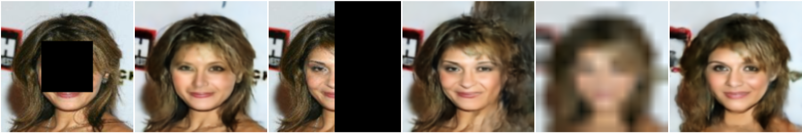

# Latent Convolutional Models



*Sample resotrations using a Latent Convolutional Model.*


Latent Convolutional Models work by parametrizing the latent space of a generator using convolutional neural networks. A schematic can be found below


*The Schematic of a Latent Convolutional Model. The smaller ConvNet **f** (red) is unique to each image is parametrize the latent space of the generator **g_theta** (magenta) which is common to all images. The input **s** is fixed to random noise and is not updated during the training process.*


## Installation Dependencies

- numpy 1.14.3
- pytorch 0.4.0
- [tensorboard-pytorch](https://github.com/lanpa/tensorboard-pytorch)
- [scikit-image](https://scikit-image.org/)

# Citation
To cite this work, please use
```
@INPROCEEDINGS{LCMAthar2019,
  author = {ShahRukh Athar and Evgeny Burnaev and Victor Lempitsky},
  title = {Latent Convolutional Models},
  booktitle = {International Conference on Learning Representations (ICLR)},
  year = {2019}
}
``` 

# Additional Resources

- [Webpage](http://shahrukhathar.github.io/2018/06/06/LCM.html)
- [Paper](https://arxiv.org/abs/1806.06284)
- [Supplementary Material](https://drive.google.com/file/d/1K3AceiLhxSPzVdu_-CtZQ7cZnKtxNPCY/view?usp=sharing)


